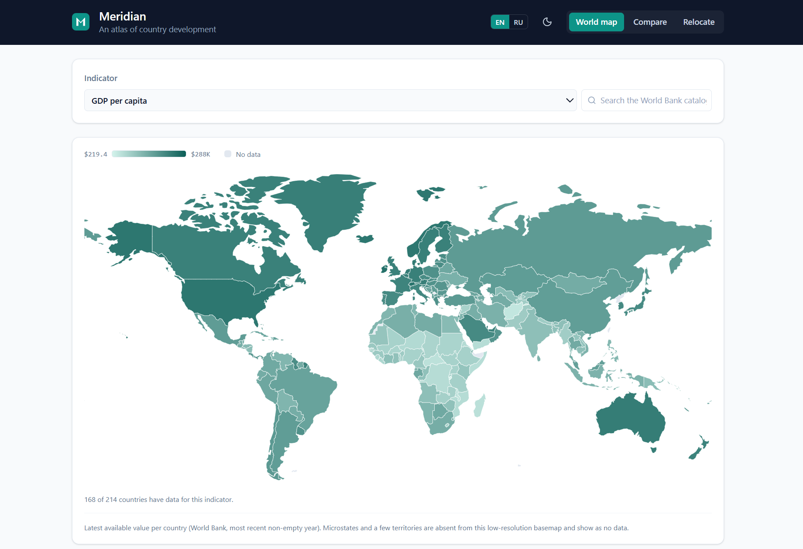

# Meridian

**An atlas of country development, built on [World Bank Open Data](https://data.worldbank.org/).**
Compare up to five countries across decades on any indicator, rank places to live
by what you care about, and color the whole world by a chosen indicator on an
interactive map — all from live data, no API key required.



## Stack

- [Vite](https://vitejs.dev/) + [React](https://react.dev/) (JavaScript)
- [Tailwind CSS v4](https://tailwindcss.com/) (via the `@tailwindcss/vite` plugin — no `tailwind.config.js`)
- [recharts](https://recharts.org/) for charts
- [react-simple-maps](https://www.react-simple-maps.io/) + [d3-geo-projection](https://github.com/d3/d3-geo-projection) for the world map
- [lucide-react](https://lucide.dev/) for icons

## Getting started

```bash
npm install && npm run dev
```

Then open the printed local URL. To produce a production build:

```bash
npm run build      # outputs to dist/
npm run preview    # serve the build locally
```

On first load a small on-brand splash (the globe mark + a spinner, in your saved
light or dark theme) shows instantly while the JS bundle and country list load, then
is replaced the moment React mounts.

## Tests

The pure logic modules have a [Vitest](https://vitest.dev/) unit-test suite — **69
tests** covering the ranking math, URL-state encode/decode (including hostile-input
robustness), number/unit formatting per locale, the country/region/indicator
resolvers, and the Compare data merge + log-domain helper.

```bash
npm test            # run the suite once
npm run test:watch  # watch mode
```

## The three modes

- **Compare** — build a shared set of up to five countries (chips with stable,
  per-country colors; add or remove any of them) that applies to every chart on
  screen. Add as many charts as you like; each chart plots any indicator you
  choose, from a curated list of ~24 presets **or** a live search over the full
  World Bank WDI catalog (~1,486 indicators). The latest value for each country is
  called out above every chart. The same indicator can't be charted twice at once.
  Each chart has its own **Linear / Log** y-axis toggle (default Linear) — handy when
  countries of very different magnitude share one chart (e.g. population: USA vs
  China), so the smaller line isn't squashed flat.
- **Relocate** — pick the criteria that matter from **13 development indicators**
  (income, unemployment, inflation, healthcare, longevity, infant mortality, safety,
  internet, electricity, clean water, urbanization, literacy, CO₂ per capita) and
  give each one a **priority** — _Not important_ / _Important_ / _Very important_.
  Direction is built in: for "lower is better" criteria (unemployment, inflation,
  infant mortality, homicide rate, CO₂) a low value scores high. Narrow the field to
  a single World Bank region, and set a data-recency threshold (last 3, 5, or 10
  years, or all time — default 5) so only sufficiently fresh figures count; each
  country shows the year its data comes from. The result is a ranked shortlist (see
  the note below on how it's scored).
- **World map** — an interactive choropleth (Miller projection) that colors every
  country by a chosen indicator, using the **same preset list and live WDI catalog
  search as Compare** (default: GDP per capita). Each country is shaded on a
  light-to-dark teal scale from its latest available value; countries with no data —
  or too small to draw on the basemap — are left gray. Hover any country for a
  tooltip with its name, value, and data year, and read the scale from the min/max
  legend.

## Sharing

The active tab and its settings are encoded in the URL as readable query params, so
copying the address bar shares the exact view and a reload restores it. Only the
active tab's settings are in the URL; switching tabs swaps them. For example:

```
?tab=compare&countries=USA,CHN&charts=gdppc,pop&scales=pop
?tab=relocate&region=Europe%20%26%20Central%20Asia&recency=5&criteria=income:2,safety:1
?tab=map&indicator=internet
```

The URL is treated as untrusted: anything missing, malformed, or unknown falls back
to a sensible default rather than breaking the view.

## Localization

Meridian ships in **English and Russian**, switchable live from an **EN / RU toggle in
the header** (next to the light/dark theme toggle). The choice persists across reloads
and is applied before first paint, so there's no flash of the wrong language. Switching
re-renders everything at once: all UI strings, ~217 country names, and the ~24 preset
indicator labels — and numbers reformat for the locale (e.g. `ru-RU` grouping and
compact units, `1,2 млн` rather than `1.2M`).

The architecture is built for **N locales, and that extensibility is the point**:
adding a language is purely data, with no component changes —

1. one more dictionary in [`src/lib/i18n.js`](src/lib/i18n.js) (`messages.<locale>`),
2. an ISO-3 → name dictionary for [`src/lib/countries.js`](src/lib/countries.js), and
3. a `label_<locale>` on each preset in [`src/lib/constants.js`](src/lib/constants.js).

`t(key, vars)` reads the current locale and falls back to English (then the key) for
any missing string, so a partial translation degrades gracefully.

**Known limitation:** the ~1,486 WDI catalog search results stay in English. The World
Bank catalog is English-only, so searched (non-preset) indicators aren't translated —
only the curated presets are.

## Data

All figures come from the **World Bank Open Data API** (`https://api.worldbank.org/v2`)
— no key, CORS is open, and everything is fetched directly from the browser.

World Bank data lags ~1–2 years, so the time series end at last year and the "most
recent" value for a given country is typically from **2023–2024**, not the current
year — and different countries' latest values can come from different years. That
mismatch is exactly why Relocate exposes the per-country data year and a recency
threshold (instead of silently mixing stale and fresh numbers), and why the World
map's tooltip always shows each country's value alongside the year it's from.

## Adding a new indicator

The curated presets live in [`src/lib/constants.js`](src/lib/constants.js), grouped
by theme. To add one, append a row to the `INDICATORS` map:

```js
gni: { key: "gni", code: "NY.GNP.PCAP.CD", label: "GNI per capita (Atlas)", label_ru: "ВНД на душу населения (Атлас)", unit: "$", monetary: true },
```

- `code` is the World Bank indicator code.
- `label` is the English name; add `label_ru` (and a `label_<locale>` for any future
  locale) for the localized preset label — it falls back to `label` if absent.
- `unit` drives formatting: `"$"`, `"%"`, `"yrs"`, and `"ppl"` are handled
  specially; any other string (e.g. `"per 1,000"`, `"t"`) is rendered as a suffix,
  and an empty/unknown unit falls back to compact `K`/`M`/`B` numbers — which is
  also what indicators picked via catalog search use.
- Set `monetary: true` for money values — they're heavy-tailed across countries, so
  the World map places them on a logarithmic color ramp.

You don't have to touch the presets to chart or map something one-off: the catalog
search box in both Compare and the World map reaches the whole WDI catalog directly.

## A note on the Relocate ranking

The ranking is a **simplified livability index**, not an authoritative one. For each
selected criterion, every country is scored by its **percentile rank** within the
filtered set (0–100) — its standing among the countries that pass the active region
and recency filters. "Lower is better" criteria are inverted, so a low raw value
earns a high score, and a country's overall index is the **priority-weighted
average** of those per-criterion scores (_Very important_ counts double _Important_;
_Not important_ drops the criterion entirely). Scoring by percentile is naturally
robust to outliers and is recomputed whenever the filters change — so "best in
Europe" is ranked relative to Europe, not the world.

## Possible future directions

Everything on the original roadmap has shipped. A few optional ideas — not planned or
promised, just directions someone could take this:

- An accessibility / mobile-polish pass.
- A custom themed dropdown to replace the native `<select>`, so option lists fully
  pick up the theme and localization.
- Optional pan / zoom on the World map for reading small countries.
- A CI workflow to run the test suite on every push.

## License

[MIT](LICENSE)
